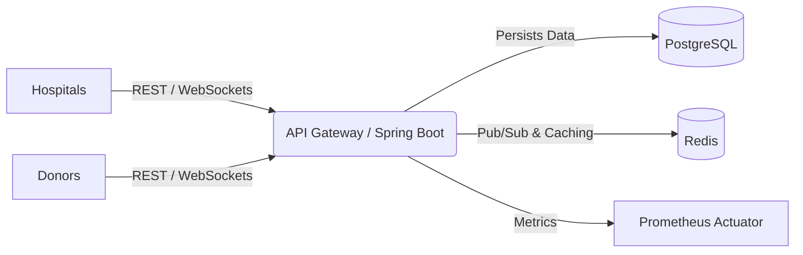
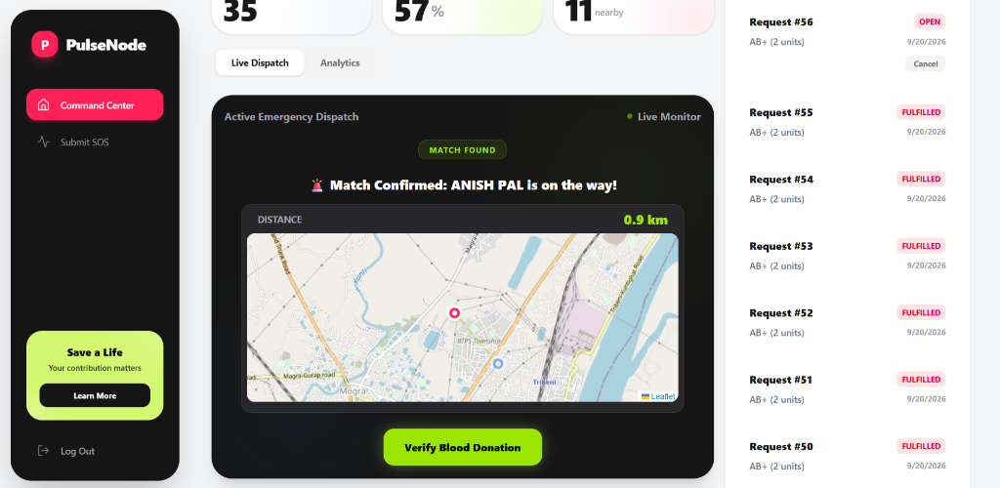
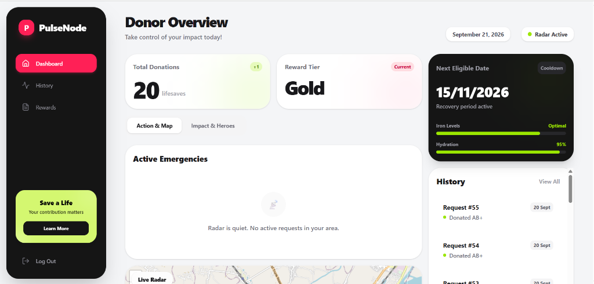
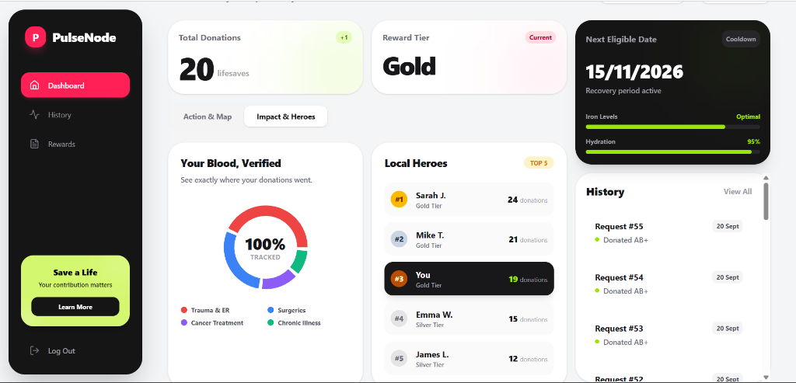
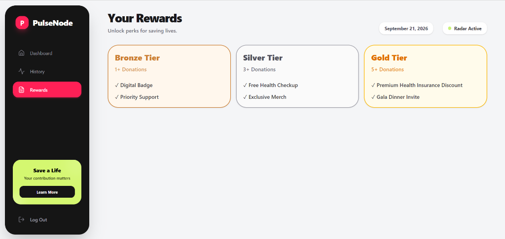
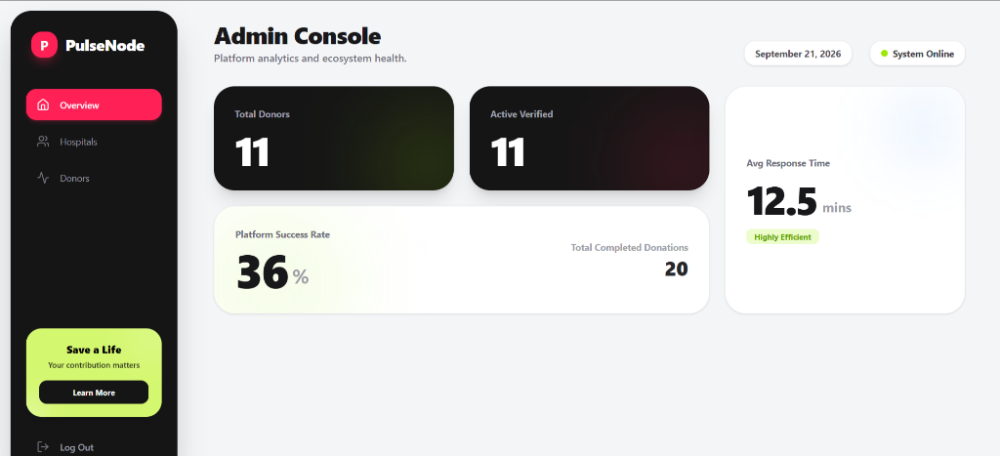

<div align="center">
  <div style="background-color: #f43f5e; color: white; width: 64px; height: 64px; border-radius: 16px; display: inline-flex; align-items: center; justify-content: center; font-size: 32px; font-weight: bold; margin-bottom: 20px;">P</div>
  <h1>PulseNode</h1>
  <p><strong>An Algorithmic Emergency Blood Dispatch System</strong></p>
  <p>🔴 <strong><a href="https://pulse-node-frontend.vercel.app/">Live Demo</a></strong></p>

[](https://reactjs.org/)
[](https://spring.io/projects/spring-boot)
[](https://www.postgresql.org/)
[](https://redis.io/)
[](https://www.docker.com/)

</div>

<br />

PulseNode is a real-time, event-driven emergency dispatch network that algorithmically matches hospitals facing critical blood shortages with eligible, verified donors within a 10km radius.

By utilizing geospatial routing, WebSockets, and a fast, reactive UI, PulseNode reduces the theoretical time to locate a blood donor to under 1 minute.

---

## ⚡ Features

- 📍 **Geospatial Dispatch Engine:** Uses the Haversine formula via PostGIS/Leaflet to ping only eligible donors within a strict radius of the emergency.
- ⚡ **Real-Time WebSockets Radar:** Powered by Spring WebSockets (STOMP), broadcasting active emergencies and dynamic GPS tracking directly to the UI without polling.
- 🏆 **Dynamic Gamification:** Generates on-the-fly, high-resolution shareable HTML-to-Canvas achievement cards when users successfully complete a donation.
- 📱 **Mobile-First App Experience:** A hyper-dense, app-like frontend built with React and Tailwind CSS that acts and feels like a native mobile application.
- 🚀 **Enterprise Architecture:** Built on Spring Boot with a PostgreSQL persistence layer, caching strategies, and Flyway database migrations.

---

## 🏗️ System Architecture

PulseNode follows a decoupled Monorepo structure, separating the presentation layer from the high-throughput matching engine.



### 💻 Frontend (`/frontend`)

- **React 18 & Vite** for lightning-fast HMR and optimized production builds.
- **Tailwind CSS** for completely custom, responsive, utility-first styling.
- **React Leaflet** for rendering real-time maps and routing polyline paths.
- **Recharts** for rendering administrative analytics and hospital dispatch statistics.

### ⚙️ Backend (`/backend`)

- **Java 17 & Spring Boot 3** for robust, enterprise-grade REST APIs.
- **Spring WebSockets & STOMP** for full-duplex communication and live radar updates.
- **Flyway** for version-controlled, production-safe database migrations (`V1__init_schema.sql`).
- **Micrometer Prometheus Actuator** for exposing JVM health metrics and API telemetry.

---

## 🚀 Quick Start

### Prerequisites

- Java 17+
- Node.js 18+
- PostgreSQL 15+
- Redis (Optional for local dev)

### 1. Database Setup

Create a PostgreSQL database named `blood_donation`.
Configure your credentials in `backend/src/main/resources/application.properties`:

```properties
spring.datasource.url=jdbc:postgresql://localhost:5432/blood_donation
spring.datasource.username=postgres
spring.datasource.password=your_password
```

_(Flyway will automatically create the schemas upon startup)_

### 2. Start the Backend

```bash
cd backend
./mvnw spring-boot:run
```

_The API will start on `http://localhost:8080`_

### 3. Start the Frontend

```bash
cd frontend
npm install
npm run dev
```

_The App will start on `http://localhost:5173`_

---

## 📸 Screenshots

### 🚑 Hospital Command Center
*Real-time map monitoring dispatch status and donor ETA.*


### ❤️ Donor Radar & Action
*Pulsing interface alerting donors of nearby emergencies.*


### 🏆 Donor Impact & Heroes
*Gamified statistics tracking lifelong impact and local leaderboards.*


### 🎁 Donor Rewards
*Tiered reward system for continuous verified donations.*


### 📊 Admin Console
*Data-rich dashboard analyzing platform volume and fulfillment rates.*


---
---

## 📜 License

This project is licensed under the MIT License - see the [LICENSE](LICENSE) file for details.

---

<div align="center">
  <i>Built with ❤️ to save lives.</i>
</div>
